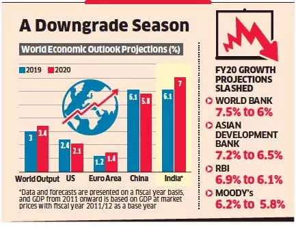

<!--   -->
 

"Under Construction"

```{r include = FALSE}
# colorFunc <- "heat.colors"
colorFunc <- "terrain.colors"
# colorFunc <- "topo.colors"
# colorFunc <- "cm.colors"
# colorFunc <- "rainbow"
```

Base R comes with many functions for generating colors. The code below demonstrates the `r colorFunc` function. 

## `r colorFunc`

```{r fig.cap = "The Maunga Whau volcano.", echo = FALSE}
image(volcano, col = get(colorFunc)(200))
```